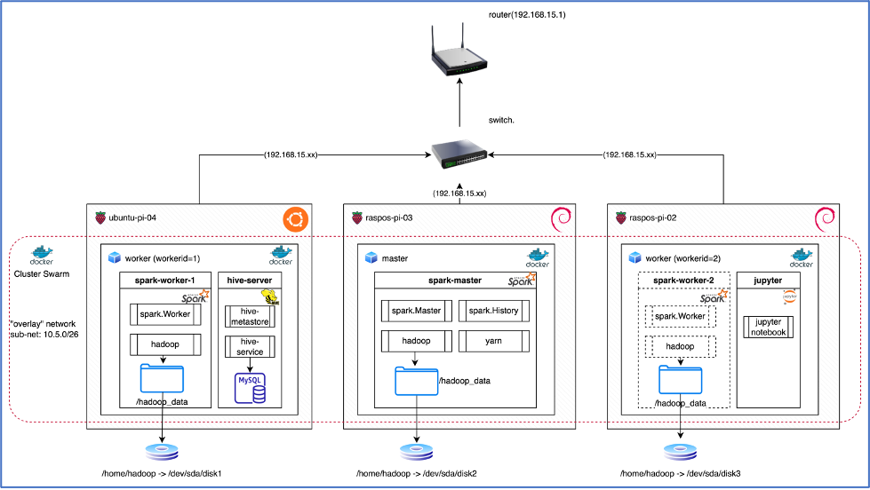

# spark-hadoop-cluster
Repositório para criação de um Cluster Spark para Ciência de dados em Raspberrypis.

Desenhei esta implementação para ser utilizada com 3 raspberrypis em rede, distribuo os componentes entre as diferentes máquinas de modo a distribuir a carga de consumo de memória e cpu:
Um será o master e os outros dois serão workers. O Master do Spark (da forma como configurei aqui) consome inicialmente 2GB de memória mas chega a consumir 4GB no pico, já os Workers do Spark e o Hive Server consomem cerca de 1GB. 

Veja no diagrama abaixo os computadores em rede e a disposição dos contêineres em cada um deles:



## Rodar Localmente
1. [Clone o repositorio](#1-clone-o-repositório)
2. [Prepare espaço de armazenamento para persistencia de dados](#2-prepare-espaco-de-armazenamento-para-persistencia-de-dados)
3. [Compilando imagens Spark, Hive e Jupyter](#3-compilando-imagens-spark,-hive-e-jupyter)
4. [Crie um cluster swarm](#4-crie-um-cluster-swarm)
5. [Deploy do cluster Spark](#5-deploy-do-cluster-spark)

### 1. Clone o repositório

Clone the `spark-tpc-ds-performance-test` repo locally. In a terminal, run:

``` 
$ git clone https://github.com/zeluizgo/spark-hadoop-cluster.git 
```

### 2. Prepare espaço de armazenameto para persistencia de dados

Elegemos o diretório /home/hadoop como um diretório comum para que nele sejam criadas as estruturas de dados do hadoop e com isso, persistir os dados entre eles:

(em todos as máquinas):
``` $ mkdir -p / home/hadoop ```
``` $ mkdir -p / home/hadoop/data ```

(e somente na máquina que será a hive-server):
``` $ mkdir -p / home/hadoop/dump ```


Dica: É possível fazer esta persistência com maior capacidade de armazenamento através do uso de HDs externos em cada máquina: basta então que a partir da pasta /home crie-se um link chamado “hadoop” apontando para uma pasta “hadoop” dentro deste HD, ex.:

``` $ ln -s /media/pidesk/Backup/hadoop hadoop ```

### 3. Compilando imagens Spark, Hive e Jupyter

* **Imagem Spark:** 

A imagem Spark deverá ser compilada usando a seguinte instrução a partir do diretório raiz onde esta estrutura foi clonada em cada uma das máquinas:

``` $ docker build -t spark-hadoop-cluster ./spark-hadoop ```

A execução acima criará uma imagem denominada spark-hadoop-cluster a partir do arquivo Dockerfile da raiz do diretório spark-hadoop.

* **Imagem Hive:** 
Já a imagem Hive deverá ser compilada usando a seguinte instrução também a partir do diretório raiz, mas somente na máquina worker-1:

``` $ docker build -t hive-server -f ./hive/Dockerfile-hive ./ ```

A execução acima criará uma imagem denominada hive-server a partir do arquivo Dockerfile-hive do diretório hive.

Dica: Agende uma tarefa no Linux nesta máquina onde estará o hive para periodicamente criar arquivo dump do metastore no mesmo diretório “dump” do /hadoop_data como mencionado anteriormente.Utilize o recurso “crontab” do linux, é simples. Esta tarefa deverá executar o seguinte:

``` $ mysqldump metastore > /hadoop_data/dump/metastore_dump.sql ```

* **Imagem Jupyter:** 

A imagem Jupyter deverá ser compilada usando a seguinte instrução também a partir do diretório raiz, mas somente na máquina worker-2:

``` $ docker build -t jupyter -f ./jupyter/Dockerfile-jupyter ./ ```

A execução acima criará uma imagem denominada jupyter a partir do arquivo Dockerfile-jupyter do diretório jupyter. A imagem do jupyter também foi isolada devido ao fato de também consumir muita memória e por ser dispensável dado que podemos submeter Jobs ao spark através de linha de comando com o spark-submit. 


### 4. Crie um cluster swarm

* Inicialize o Swarm elegendo uma das máquinas como master:

``` $ docker swarm init --advertise-addr <IP da máquina> ```

Onde IP da máquina é o numero do IP da máquina escolhida para a ser a “master” do cluster.

* Inclua as demais máquinas como workers:
Basta copiar todo o comando “docker swarm join ...” retornado na execução anterior e executá-lo nas duas outras máquinas:

Algo assim (somente um exemplo):
``` $ docker swarm join --token SWMTKN-1-2nyaeu0l2rw7fv6wpgco4o1spos0elazjxob3nitlnfy9bv15y-bdch9bt28qsviddpmc38r5hv1 10.10.0.6:2377  ```

* Marque as unidades(nó) workers como worker-1 e worker-2:

Para que fixemos no momento do deploy e réplicas que as imagens spark específicas de workers somente sejam instaladas sempre em uma mesma unidade, elas são marcadas antes adicionando-se um Label a elas (chave, valor) informando por exemplo que seu workerID é 1 e o da outra é 2:

``` docker node update --label-add workerid=1 IDXXXXX ```
``` docker node update --label-add workerid=2 IDYYYYY ```

Onde IDXXXXX e IDYYYYY é o id do nó(nodes em inglês) das máquinas worker no cluster swarm e que pode ser obtido executando o comando abaixo na máquina eleita como a master, assim:
``` docker node ls ```

### 5.	Deploy do cluster Spark

Com as imagens compiladas em todas as máquinas e o cluster swarm de pé e com as máquinas identificadas, deve-se então criar um serviço spark especifico para ser o driver (chamaremos aqui de spark-master) e outros dois serviços específicos para os executors (chamaremos aqui de spark-worker-1 e spark-worker-2). 

Para isso, a partir do manager, basta executar:
``` docker stack deploy --compose-file=docker-compose.yml spark-hadoop ```

Isto criará os serviços  spark-hadoop_spark-master, spark-hadoop_spark-worker-1 e spark-hadoop_spark-worker-2 dentro do cluster swarm.

